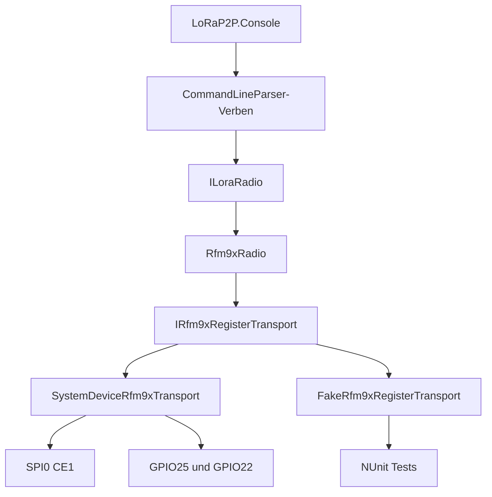

# Product Requirements Document: RFM95 Funk-Client als LoRaWAN-Basis

## 1. Dokumentstatus

| Feld | Wert |
| --- | --- |
| Produkt | LoRaP2P Console |
| Version | 1.0 (Raw-LoRa-PoC) |
| Status | Implementiert, Hardwarevalidierung ausstehend |
| Zielplattform | Raspberry Pi 3B+, Raspberry Pi OS 64-bit, .NET 10 |
| Funkhardware | Adafruit LoRa Radio Bonnet, RFM95W 868/915 MHz |
| Einsatzregion | Deutschland / EU868 |

## 2. Ausgangslage

Ein Raspberry Pi 3B+ mit Adafruit LoRa Radio Bonnet soll über eine .NET-10-Konsolenanwendung angesprochen werden. Als technische Vorlage dient `KiwiBryn/RFM9XLoRa-Net`. Dieses Projekt enthält brauchbare SX1276/RFM95-Register- und FIFO-Logik, basiert aber auf archivierten UWP-APIs und implementiert nur Raw LoRa, nicht LoRaWAN.

Version 1 validiert deshalb zuerst den direkten SPI-/GPIO-Zugriff und den Funkbetrieb.

## 3. Produktziel

Bereitstellung eines testbaren .NET-10-RFM95-Treibers und einer interaktiven Konsole, mit denen Entwickler:

- das RFM95W über SPI0/CE1 erkennen und konfigurieren,
- EU868-konforme PoC-Parameter validieren,
- Raw-LoRa-Payloads senden und empfangen,
- Register und Funkstatus diagnostizieren,
- Treiberverhalten ohne Raspberry-Pi-Hardware per NUnit prüfen

## 4. Nichtziele von Version 1

- Kein LoRaWAN OTAA oder ABP
- Keine LoRaWAN-Verschlüsselung, MIC-Berechnung oder Session Keys
- Keine ADR- oder MAC-Command-Verarbeitung
- Keine persistenten Frame Counter oder Nonces
- Kein LoRaWAN-Gateway und kein Network Server
- Keine OLED- oder Tastersteuerung
- Kein systemd-Dienst und keine unbeaufsichtigte Sensoranwendung
- Keine Bestätigung des Funkempfangs mit nur einem Transceiver

## 5. Benutzer und Anwendungsfälle

### Primärer Benutzer

Entwickler oder Maker mit C#/.NET-Erfahrung, Raspberry Pi 3B+ und Adafruit RFM95W Bonnet.

### Kernabläufe

1. Benutzer aktiviert SPI, startet die Anwendung und erhält eine erfolgreiche Chip-Erkennung (`0x12`).
2. Benutzer prüft das aktive EU868-Profil und ausgewählte SX1276-Register.
3. Benutzer sendet einen Text- oder Hex-Payload und sieht `TxDone` sowie Time-on-Air.
4. Benutzer wartet mit einem konfigurierbaren Timeout auf ein Raw-LoRa-Paket.
5. Benutzer ändert Frequenz, Spreading Factor, Bandbreite oder Leistung innerhalb der erlaubten Grenzen.
6. Entwickler führt sämtliche Treibertests auf einem Windows-Rechner ohne Funkhardware aus.

## 6. Hardware- und Plattformanforderungen

| Funktion | Zuordnung |
| --- | --- |
| SPI-Bus | SPI0 |
| Chip Select | CE1 / Chip-Select 1 |
| Reset | BCM GPIO25, aktiv Low |
| DIO0 / IRQ | BCM GPIO22, steigende Flanke |
| DIO1 | BCM GPIO23, für Version 1 nicht verwendet |
| DIO2 | BCM GPIO24, für Version 1 nicht verwendet |
| Betriebssystem | Raspberry Pi OS 64-bit |
| Runtime | selbstenthaltenes `linux-arm64`-Publish von .NET 10 |

Vor jedem Sendeversuch muss eine auf 868 MHz abgestimmte Antenne angeschlossen sein. Obwohl das RFM95W softwareseitig 868 und 915 MHz unterstützt, verwendet dieses Produkt in Deutschland ausschließlich EU868-Defaults.

## 7. Funktionale Anforderungen

### FR-001: Konfiguration

- Anwendung MUSS Konfiguration aus `appsettings.json` laden.
- Alternativer Pfad MUSS über `--config <path>` möglich sein.
- Standardprofil MUSS 868,1 MHz, SF7, BW125, CR 4/5, Payload-CRC, Syncword `0x34` und 14 dBm verwenden.
- Frequenzen außerhalb 863 bis 870 MHz MÜSSEN abgelehnt werden.
- Sendeleistungen außerhalb 2 bis 14 dBm MÜSSEN abgelehnt werden.
- Reset- und DIO0-Pin MÜSSEN unterschiedlich und nicht negativ sein.

### FR-002: Hardwaretransport

- SPI MUSS Mode 0, 8 Datenbits, 5 MHz und Hardware-Chip-Select verwenden.
- Register-Reads MÜSSEN als Full-Duplex-Transfer mit Adressbyte und Dummy-Bytes erfolgen.
- Register-Writes MÜSSEN das Write-Bit der Adresse setzen.
- Gleichzeitige SPI-Transfers MÜSSEN serialisiert werden.
- DIO0-Callbacks DÜRFEN keine SPI-Operationen durchführen; sie signalisieren nur die wartende Operation.

### FR-003: Reset und Probe

- Reset MUSS GPIO25 mindestens 1 ms Low setzen und anschließend mindestens 5 ms Initialisierungszeit geben.
- Probe MUSS Register `0x42` lesen.
- Nur Wert `0x12` gilt als erkannter SX1276/RFM95.
- Abweichungen MÜSSEN eine verständliche Fehlermeldung erzeugen.

### FR-004: Funkkonfiguration

- Treiber MUSS Frequenz-, PA-, LNA-, Modem-, Präambel-, CRC-, IQ- und Syncword-Register setzen.
- Konfiguration MUSS im Sleep-Modus beginnen und im Standby-Modus enden.
- Low-Data-Rate-Optimization MUSS anhand der Symboldauer gesetzt werden.

### FR-005: Senden

- Payloadlänge MUSS 1 bis 255 Bytes betragen.
- FIFO-Adresse, Payload und Payloadlänge MÜSSEN vor TX gesetzt werden.
- DIO0 MUSS auf `TxDone` gemappt werden.
- TX MUSS durch Timeout und Cancellation abbrechbar sein.
- Nach Erfolg oder Fehler MUSS das Radio in Standby zurückkehren.
- Erfolgsausgabe MUSS `TxDone` heißen und darf keinen Empfang durch eine Gegenstelle behaupten.
- Time-on-Air und konservative Sendepause gemäß konfiguriertem Duty Cycle MÜSSEN berechnet werden.

### FR-006: Empfangen

- Anwendung MUSS einen einzelnen Empfang mit Timeout starten können.
- DIO0 MUSS auf `RxDone` gemappt werden.
- Payload MUSS über `FifoRxCurrentAddress` und `RxByteCount` gelesen werden.
- CRC-Status, Packet RSSI und Packet SNR MÜSSEN ausgegeben werden.
- Ein Timeout MUSS ohne unbehandelten Fehler enden.
- Nach Abschluss MUSS das Radio in Standby zurückkehren.

### FR-007: Interaktive Konsole

Folgende Befehle MÜSSEN vorhanden sein:

| Befehl | Verhalten |
| --- | --- |
| `probe` | Chipversion prüfen |
| `status` | Modus, IRQ und Funkprofil ausgeben |
| `reset` | Hardware zurücksetzen und Profil neu anwenden |
| `configure frequency <MHz>` | EU868-Frequenz setzen |
| `configure sf <7-12>` | Spreading Factor setzen |
| `configure bandwidth <125\|250\|500>` | Bandbreite setzen |
| `configure power <2-14>` | Leistung setzen |
| `send text <value>` | UTF-8-Payload senden |
| `send hex <bytes>` | Binärpayload senden |
| `receive [seconds]` | Ein Paket oder Timeout abwarten |
| `register read <address> [count]` | Register lesen |
| `register dump` | Register `0x01` bis `0x42` ausgeben |
| `quit` | Anwendung sauber beenden |

Eine generische Register-Schreibfunktion ist absichtlich nicht Teil des normalen CLI, um versehentliche unzulässige Funkkonfigurationen zu vermeiden.

## 8. Nichtfunktionale Anforderungen

### NFR-001: Testbarkeit

- Radiozustandsmaschine MUSS ausschließlich von `IRfm9xRegisterTransport` abhängen.
- Konsolenbefehle MÜSSEN ausschließlich über `ILoraRadio` testbar sein.
- Unit-Tests MÜSSEN ohne GPIO, SPI oder Raspberry Pi ausführbar sein.
- NUnit 4.4.0 und NUnit3TestAdapter 5.0.0 werden verwendet.

### NFR-002: Robustheit

- Keine Funkoperation darf unbegrenzt blockieren.
- Cancellation und Timeout müssen den Radiozustand wiederherstellen.
- Transport und Radio müssen deterministisch freigegeben werden.
- SPI-Zugriffe dürfen nicht parallel erfolgen.

### NFR-003: Sicherheit

- Version 1 enthält keine Schlüssel oder Geheimnisse.
- Künftige AppKeys dürfen weder im Repository noch in Logs oder Standard-JSON gespeichert werden.
- Betrieb soll über `spi`- und `gpio`-Gruppen erfolgen, nicht dauerhaft als Root.

### NFR-004: Wartbarkeit

- Hardwaretransport, RFM95-Treiber, Konsolen-UI und Tests bleiben getrennt.
- `ILoraRadio` enthält keine LoRaWAN-spezifischen Typen.
- Build-Warnungen werden als Fehler behandelt.

## 9. Architektur

## 10. Akzeptanzkriterien

### Ohne Hardware

- `dotnet restore` ist erfolgreich.
- `dotnet build LoRaP2P.sln --configuration Release` ist ohne Warnungen erfolgreich.
- `dotnet test LoRaP2P.sln --configuration Release` führt alle NUnit-Tests erfolgreich aus.
- Kommando-Parsing und alle Verben sind ohne Funkhardware getestet.
- Frequenzkonvertierung, EU868-Validierung, Time-on-Air, Registerkonfiguration, TX, RX und Reset/Probe sind getestet.
- `linux-arm64` Self-contained Publish ist erfolgreich.

### Mit einem Bonnet

- `/dev/spidev0.1` ist vorhanden.
- Anwendung liest Chipversion `0x12`.
- `status` zeigt 868,1 MHz, SF7, BW125 und 14 dBm.
- `send text ping` endet über DIO0 mit `TxDone`.
- Timeout und Ctrl+C lassen das Radio im Standby-Modus zurück.

### Mit zweitem RFM9x-Gerät

- Beide Geräte verwenden identische Frequenz-, SF-, BW-, CR-, Präambel-, CRC- und Syncword-Werte.
- Text- und Binärpayloads werden unverändert empfangen.
- CRC-Status, RSSI und SNR werden plausibel ausgegeben.
- Abweichende Frequenz oder abweichendes Syncword führen reproduzierbar zum Timeout.

## 11. Risiken und Gegenmaßnahmen

| Risiko | Gegenmaßnahme |
| --- | --- |
| `TxDone` wird als erfolgreicher Empfang missverstanden | CLI und Dokumentation unterscheiden explizit zwischen internem TX-Abschluss und Funkempfang |
| Falsche Antenne oder Frequenz | EU868-Validierung und deutlicher Antennenhinweis |
| DIO0-Flanke fehlt | Konfigurierbarer Timeout, Standby-Recovery und Diagnose über Registerdump |
| Ursprungsprojekt ist archiviert | Nur Registerwissen übernehmen; moderne, eigene Transport- und Zustandsarchitektur |
| Ein Bonnet reicht nicht für End-to-End-Test | Zweites RFM9x-Gerät als definierter Folgemeilenstein |
| RFM95 ist kein LoRaWAN-Gateway | Später echten SX1302/SX1303-Multichannel-Gateway einsetzen |

## 12. Raw-LoRa-Zwei-Wege-Kommunikation

Nach erfolgreichem bidirektionalem Funkgerätetest wird ein kleines P2P-Protokoll oberhalb von `ILoraRadio` implementiert. Zwei Raspberry Pis mit jeweils einem kompatiblen RFM9x-Transceiver kommunizieren direkt miteinander. Gateway, Network Server, Internetverbindung und LoRaWAN-Provisionierung werden dafür nicht benötigt.

### 12.1 Gemeinsames Funkprofil

Beide Geräte MÜSSEN dieselben Werte für Frequenz, Spreading Factor, Bandbreite, Coding Rate, Präambel, Syncword, Header-Modus, Payload-CRC und IQ-Einstellung verwenden. Der Funkbetrieb bleibt halbduplex: Ein Gerät kann zu einem Zeitpunkt entweder senden oder empfangen.

### 12.2 P2P-Frame

Jede Nachricht MUSS einen versionierten binären Protokollkopf enthalten:

| Feld | Zweck |
| --- | --- |
| Protokollversion | Erlaubt spätere kompatible Erweiterungen |
| Nachrichtentyp | `Data`, `Ack` oder `Error` |
| Absender-ID | Identifiziert das sendende Gerät |
| Empfänger-ID | Identifiziert Zielgerät oder Broadcast |
| Sequenznummer | Ordnet ACKs zu und erkennt Duplikate |
| Payloadlänge | Validiert den Frame vor Verarbeitung |
| Payload | Anwendungsdaten innerhalb der RFM95-Nutzlastgrenze |

Mehrbyte-Felder MÜSSEN eine festgelegte Byte-Reihenfolge verwenden. Frames mit unbekannter Version, falscher Länge, unbekanntem Nachrichtentyp oder unpassender Empfänger-ID MÜSSEN verworfen werden.

### 12.3 Zustellung und Bestätigung

1. Der Sender wechselt nach einem `Data`-Frame sofort in den Empfangsmodus.
2. Der Empfänger beantwortet einen gültigen, direkt adressierten Frame nach einer kurzen definierten Wartezeit mit einem `Ack`, das Absender-ID und Sequenznummer bestätigt.
3. Bleibt das ACK aus, MUSS der Sender bis zu einer konfigurierbaren Höchstzahl erneut senden.
4. Zwischen Wiederholungen MUSS ein zufälliger Backoff innerhalb eines konfigurierbaren Bereichs liegen, um wiederholte Kollisionen zu reduzieren.
5. EU868-Time-on-Air und Duty-Cycle-Wartezeiten MÜSSEN auch für ACKs und Retries eingehalten werden.
6. Nach Erreichen der Retry-Grenze MUSS die Nachricht als nicht zugestellt gemeldet werden.

Ein ACK bestätigt nur den Empfang des P2P-Frames durch das Zielgerät. Es bestätigt nicht, dass die Nutzlast fachlich verarbeitet wurde.

### 12.4 Duplikate und Reihenfolge

- Jedes Gerät MUSS zuletzt empfangene Sequenznummern je Absender für ein begrenztes Zeitfenster speichern.
- Ein wiederholter `Data`-Frame MUSS erneut bestätigt, darf aber nicht erneut an die Anwendung ausgeliefert werden.
- Ein Neustart darf die Funkkommunikation nicht dauerhaft blockieren. Initiale Sequenznummern und Überlaufverhalten MÜSSEN eindeutig definiert werden.
- Broadcast-Frames werden nicht bestätigt, damit keine ACK-Kollisionen zwischen mehreren Empfängern entstehen.

### 12.5 Optionale Authentifizierung und Verschlüsselung

Raw LoRa stellt selbst keine Vertraulichkeit, Absenderauthentifizierung oder Replay-Sicherheit bereit. Für geschützte Kommunikation MUSS optional AES-GCM mit einem vorher auf beiden Geräten provisionierten Schlüssel eingesetzt werden:

- Jede verschlüsselte Nachricht MUSS einen unter dem Schlüssel eindeutigen Nonce verwenden.
- Protokollkopf und Adressen MÜSSEN als Additional Authenticated Data geschützt werden.
- Frames mit ungültigem Authentication Tag MÜSSEN ohne ACK verworfen werden.
- Schlüssel DÜRFEN nicht in `appsettings.json`, Logs oder dem Repository gespeichert werden.
- Schlüssel und persistenter Nonce-Zustand MÜSSEN über restriktiv lesbare externe Dateien oder einen Secret Store geladen werden.

Unverschlüsselter Betrieb bleibt für lokale Funk- und Reichweitentests möglich und MUSS in der Konsole deutlich als nicht authentifiziert gekennzeichnet werden.

### 12.6 Konsolenfunktionen

Die Konsole wird um folgende Befehle erweitert:

| Befehl | Verhalten |
| --- | --- |
| `peer id <id>` | Eigene Geräte-ID konfigurieren |
| `peer add <id>` | Bekannte Gegenstelle registrieren |
| `listen` | Fortlaufend Frames empfangen und adressierte Nachrichten bestätigen |
| `send-to <id> text <value>` | Text mit ACK und Retry senden |
| `send-to <id> hex <bytes>` | Binärdaten mit ACK und Retry senden |
| `broadcast text <value>` | Nachricht ohne ACK an alle Empfänger senden |
| `peers` | Bekannte Geräte und letzte Empfangswerte anzeigen |
| `stats` | TX, RX, ACKs, Retries, Timeouts, Duplikate und CRC-Fehler anzeigen |

### 12.7 Akzeptanzkriterien

- Zwei Raspberry Pis tauschen abwechselnd Text- und Binärnachrichten aus.
- Direkt adressierte Nachrichten werden nur vom vorgesehenen Gerät ausgeliefert.
- ACKs werden anhand von Absender und Sequenznummer eindeutig zugeordnet.
- Bei absichtlich verworfenem ersten ACK wird dieselbe Nachricht erneut gesendet, aber nur einmal an die Empfängeranwendung ausgeliefert.
- Nach ausgeschöpfter Retry-Grenze meldet der Sender einen nachvollziehbaren Zustellfehler.
- Gleichzeitige Sendeversuche werden durch zufälligen Backoff aufgelöst.
- Duty-Cycle-Grenzen gelten für Datenframes, ACKs und Retries.
- Bei aktivierter Verschlüsselung werden manipulierte Frames und wiederverwendete Nonces abgelehnt.
- Alle Frame-, ACK-, Retry-, Duplikat- und Kryptografiefälle sind mit NUnit ohne Funkhardware getestet.

Diese P2P-Ausbaustufe ist ein eigenes Release und nicht Bestandteil der Akzeptanz von Version 1. Sie ersetzt keinen standardisierten LoRaWAN-Stack und ist nicht mit LoRaWAN-Gateways kompatibel.
