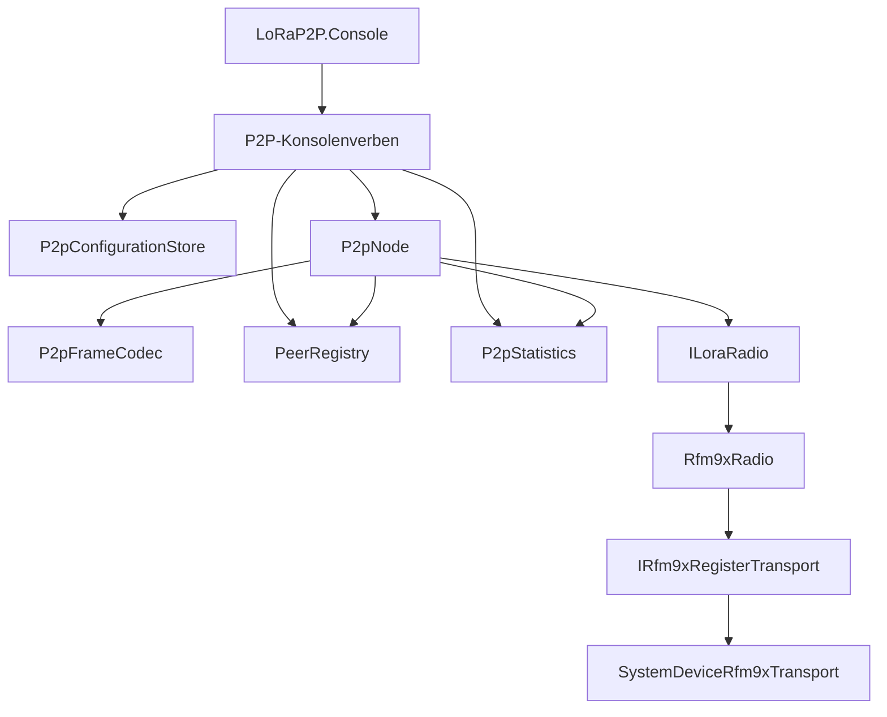
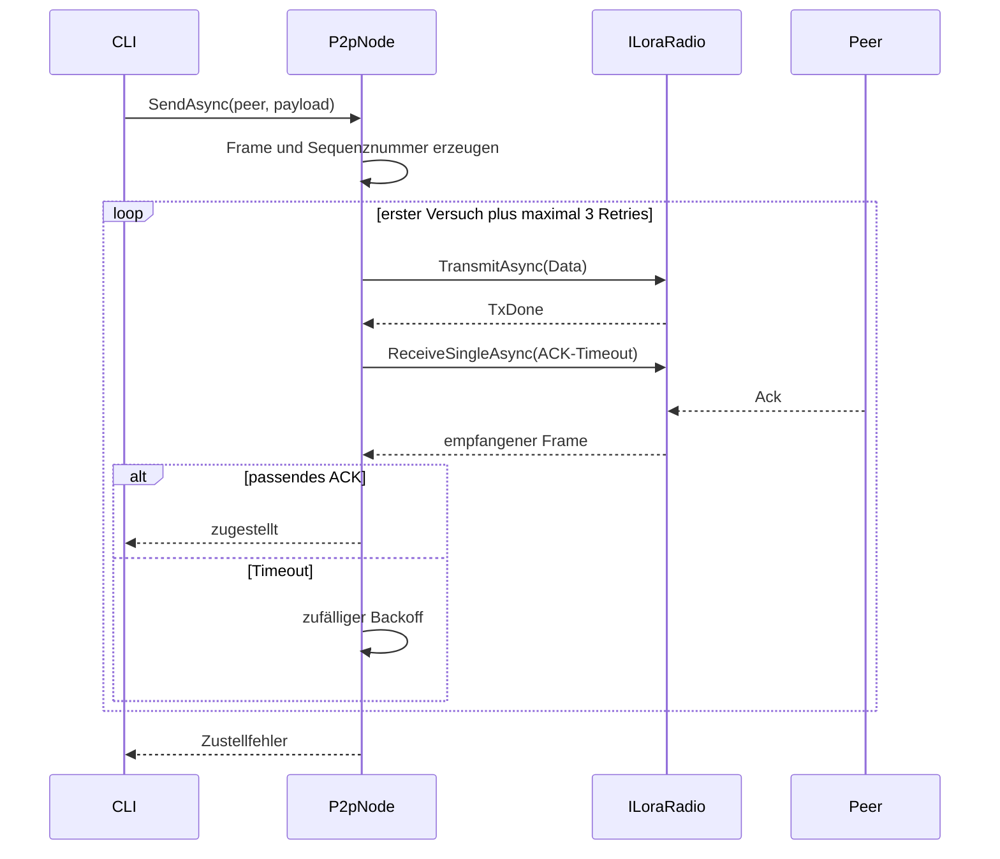

# Zielarchitektur der P2P-Ausbaustufe

## 1. Schichten

Die P2P-Logik wird als eigenes Projekt `LoRaP2P.Protocol` zwischen Konsole und
`ILoraRadio` eingeführt. Dadurch bleiben Frameformat, ACKs, Retries und
Duplikaterkennung unabhängig von CommandLineParser und der RFM95-Hardware.



## 2. Projektstruktur

Geplant:

```text
src/
  LoRaP2P.Console/
    Commands/
    P2p/
  LoRaP2P.Protocol/
    Frames/
    Peers/
    Reliability/
    Statistics/
  LoRaP2P.Radio.Rfm9x/

tests/
  LoRaP2P.Console.Tests/
  LoRaP2P.Protocol.Tests/
  LoRaP2P.Radio.Rfm9x.Tests/
```

Abhängigkeiten:

- `LoRaP2P.Protocol` referenziert `LoRaP2P.Radio.Rfm9x`, um `ILoraRadio` und
  die Empfangsmodelle zu verwenden.
- `LoRaP2P.Console` referenziert `LoRaP2P.Protocol`.
- `LoRaP2P.Radio.Rfm9x` kennt weder P2P-Kommandos noch Peer-Zustand.
- Der Frame-Codec besitzt keine Hardware- oder Dateisystemabhängigkeit.

## 3. Kernkomponenten

### P2pFrame und P2pFrameCodec

- typisiertes unveränderliches Frame-Modell,
- deterministisches Encoding,
- vollständige Validierung beim Decoding,
- keine stillen Standardwerte für ungültige Eingaben.

### P2pNode

Orchestriert die halbduplexe Kommunikation:

- Sequenznummern vergeben,
- Daten und Broadcasts senden,
- auf ACKs warten,
- Retry und Backoff ausführen,
- fortlaufend empfangen,
- adressierte Frames zustellen,
- ACKs erzeugen,
- Duplikate unterdrücken,
- Statistik aktualisieren.

Eine Semaphore schützt vollständige P2P-Transaktionen. Die Sperre umfasst bei
adressiertem Versand sowohl TX als auch die anschließende ACK-Wartephase.

### PeerRegistry

Trennt persistente und flüchtige Daten:

- persistent: lokale ID und bekannte Peer-IDs,
- sitzungsbezogen: letzter Empfang, RSSI, SNR und letzte Sequenznummern.

### P2pStatistics

Thread-sichere sitzungsbezogene Zähler:

- gesendete und empfangene Datenframes,
- gesendete und empfangene ACKs,
- Retries,
- ACK-Timeouts,
- Duplikate,
- CRC-Fehler,
- verworfene ungültige oder fremd adressierte Frames,
- Zustellfehler.

### P2pConfigurationStore

- lädt und validiert die separate JSON-Datei,
- schreibt Änderungen atomar über temporäre Datei und Ersetzung,
- meldet I/O- und Validierungsfehler explizit,
- speichert keine Schlüssel.

## 4. Sendeablauf



`TxDone` bleibt vom Peer-ACK getrennt. Nur ein korrekt zugeordnetes ACK meldet
eine P2P-Zustellung.

## 5. Listen-Ablauf

`listen` ruft wiederholt `ReceiveSingleAsync` mit einem kurzen internen
Timeout auf, damit Cancellation regelmäßig beobachtet wird.

Für jeden empfangenen Frame:

1. RFM95-CRC prüfen.
2. Frame vollständig decodieren.
3. Adressierung prüfen.
4. Statistik und Peer-Metadaten aktualisieren.
5. Duplikat erkennen.
6. Neue Daten an die Konsole ausliefern.
7. Direkt adressierte Daten nach 100 ms bestätigen.

Strg+C beendet den Prozess. Der bestehende Cancellation-Pfad stellt den
Standby-Modus des Radios wieder her.

## 6. Testarchitektur

Zusätzlich zum vorhandenen `FakeLoraRadio` wird für Protokolltests ein
skriptbarer Fake benötigt:

- Warteschlange eingehender Pakete,
- Aufzeichnung aller gesendeten Frames,
- steuerbare Timeouts und CRC-Fehler,
- deterministische Uhr über `TimeProvider`,
- deterministische Backoff-Werte über eine injizierte Zufallsquelle.

Damit werden Retries und Timeouts ohne echte Wartezeit getestet.

